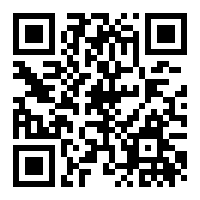
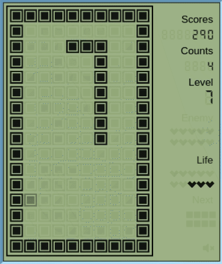

# palm-game
A palm game console built on Typescript + React + Redux + RxJS.

## Todo list

- [x] Snake
- [x] Tetris
- [ ] more games
- [ ] optimize on mobile client
- [ ] better appearance/css

## Games

* Change game: `select` or 
* Start game: `start` or 
* Increase level: 
* Decrease level: 
* Pause game: during game `start` or 
* Quit game: when game paused `select` or  2 times

### Tetris

* Move:   
* Rotate: 
* Hard drop: 

### Snake

* Change direction:    

## Performance

Prod build:
* Snake - per frame <10ms 

## Build & Run

1. install `node/npm`
2. `cd ui`
3. `npm install`
4. `npx webpack-dev-server`
5. open your browser at `127.0.0.1:9000`

## Acknowledgement

Some Css styles are borrowed from the Internet.

## Author

Cause Chung(cuzfrog@gmail.com)
